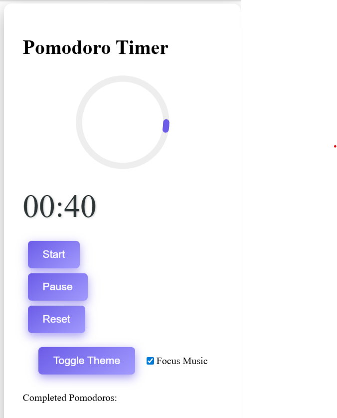

# 🍅 Pomodoro Timer Web App (Flask)

A beautiful productivity timer built using **Flask**, **HTML/CSS**, and **JavaScript** — complete with a circular animation ring, dark mode, and focus music!

---

## 🚀 Features

- ⏱️ Start / Pause / Reset timer
- 🌀 Circular progress ring animation
- 🌓 Dark mode toggle
- 🎵 Background focus music
- ✅ Cycle tracker with break reminders

---

## 💻 How to Run Locally

> 💡 Make sure Python is installed on your computer.

### 🧱 Step-by-step:

1. **Download or clone the repo**
   ```bash
   git clone https://github.com/yourusername/pomodoro-flask.git
   cd pomodoro-flask


Create a virtual environment

bash
Copy
Edit
python -m venv venv

Activate the environment

On Windows:
powershell
venv\Scripts\Activate.ps1

On macOS/Linux:
bash
source venv/bin/activate

Install required packages
pip install flask
pip install gunicorn

Run the app
python app.py

Open your browser
cpp
ex:http://127.0.0.1:5000


📸 Screenshot


